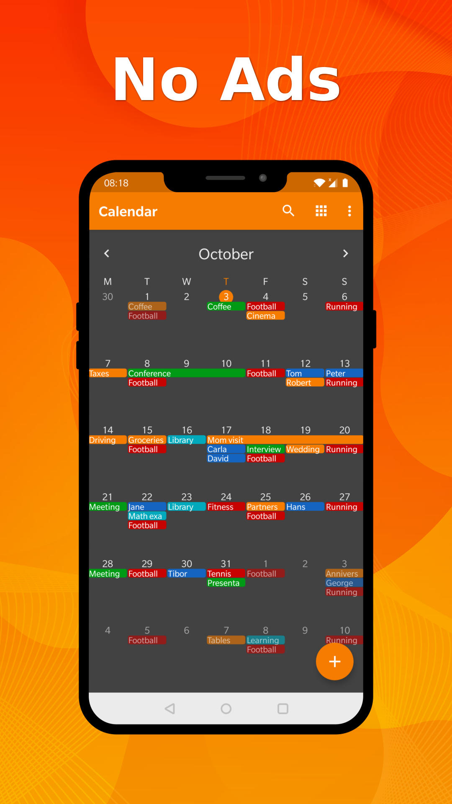
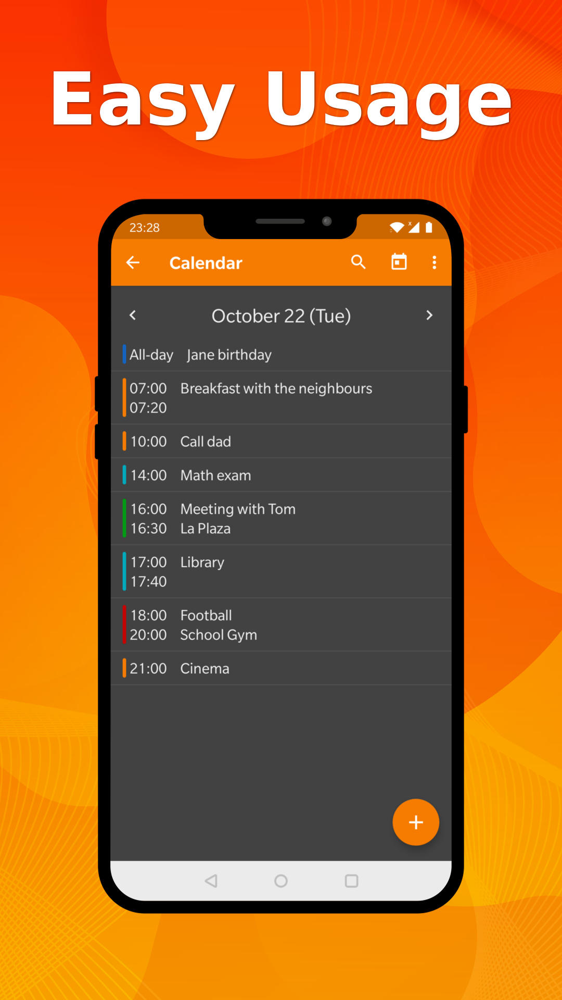
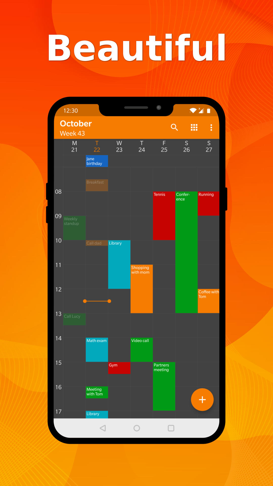

# Simple Calendar

This app i build base on base source code of https://www.simplemobiletools.com
https://github.com/SimpleMobileTools/Simple-Calendar

A simple calendar with events and a customizable widget with feature allow user to add date user want to die and it will count down to that day.
User can add event and it will tell how much time to do that to the day you die.

Ideal come from my mentor to show us to respectful our life more

## My app will be continute update more amazing feature

